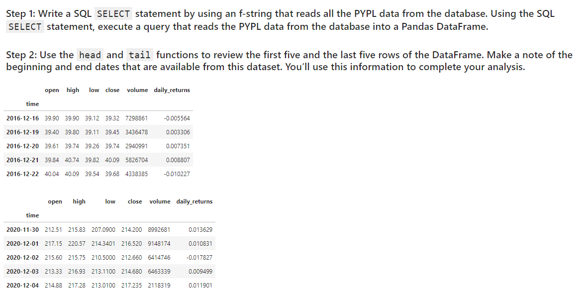
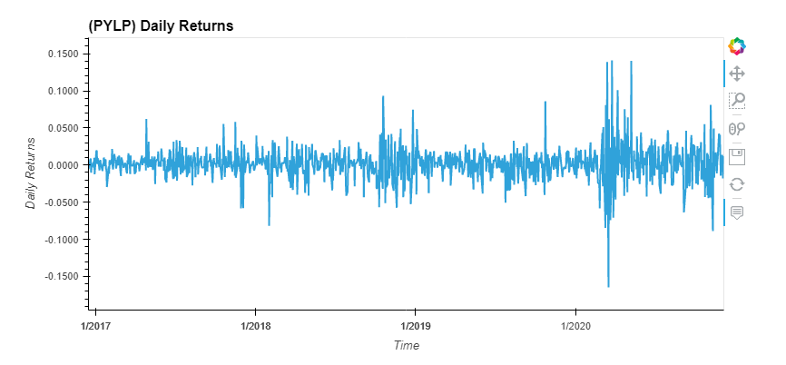
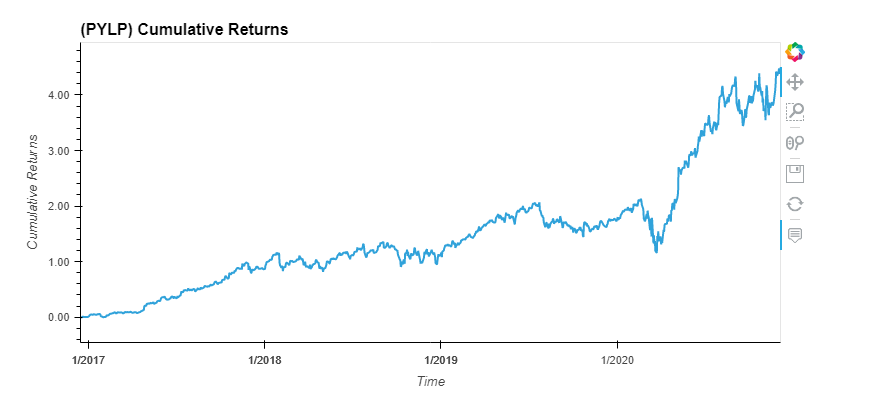
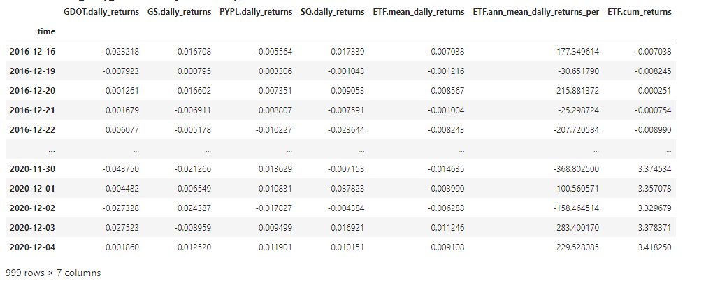
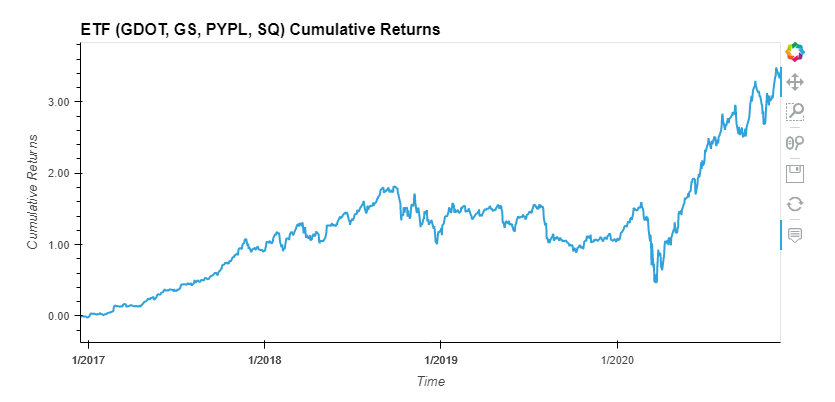

# Columbia Fintech Bootcamp: Module #7 Challenge

Feature Summary: ETF Analysis

     * Build a financial database and web application by using SQL, Python, and the Voilà library to analyze the performance of a hypothetical fintech ETF

- Includes the following tasks:

    * Analyze a Single Asset in the ETF.
    * Optimize Data Access with Advanced SQL Queries
    * Analyze the ETF Portfolio
    * Deploy the Notebook as a Web Application

---

## Technologies

This project leverages python 3.9 with the following packages:
* [pandas](https://github.com/pandas-dev/pandas) - A powerful data analysis toolkit.

Jupyter Lab 3.3.2 is required

- *Jupyter Lab is primarily used as a web-based development environment for the notebooks, code, and data associated with this project.  Its flexible interface allows users to configure and arrange workflows in data science*

---

## Installation Guide

Before running the application first install the following dependencies.

python pip install:  
    [pandas](https://pandas.pydata.org/)  
    [numpy](https://numpy.org/)  
    [sqlalchemy](https://www.sqlalchemy.org/)
    [hvplot.pandas](https://hvplot.holoviz.org/user_guide/Introduction.html)  

*Assumption made for module challenge: the* **Path** *module will not be required to be explicitely called out in Installation guide section*

To run Jupyter Lab, need to install Anaconda:
* [Anaconda](https://docs.anaconda.com/anaconda/install/) - an open-source distribution of the Python
---

## Usage

To run the financial planning tools application, simply clone the repository and run the **etf_analyzer.ipynb** script in Jupyter Lab:

---

## ETF Analyzer Web Application

The resultant web page is included in the repository.  To view, open up the **etf_analyzer.html** web page.

Sample screenshots:
    .
    .
    .
    .
    .

---

## Contributors

Contributors:
- Stratis Gavnoudias

---

## License

GNU GENERAL PUBLIC LICENSE Version 3, 29 June 2007
